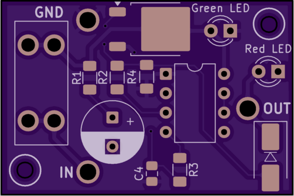

# Alternator 555 Timer

A small analog delay board for classic cars with upgraded alternators. A CMOS 555 monostable holds the alternator field (I wire) off for ~10 seconds after key-on so V-belts can spin up before the load hits — no MCU, no firmware.

**Project page:** [denton.works/projects/alternator-555-timer](https://denton.works/projects/alternator-555-timer/)  
**Repository:** [github.com/alexanderenrique/smart_tbird](https://github.com/alexanderenrique/smart_tbird/tree/platformIO/alternator_555_timer)

## What's here

- KiCad schematic and PCB (`555_I_delay.kicad_*`)
- `BOM.csv` — bill of materials
- `555_v1.zip` — zipped gerbers and drill files for your PCB manufacturer
